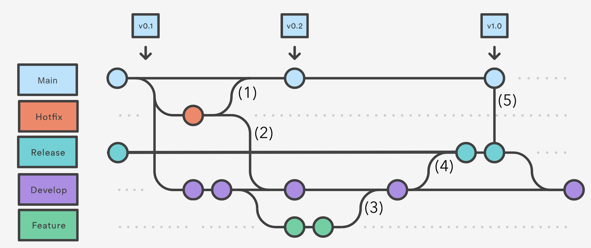
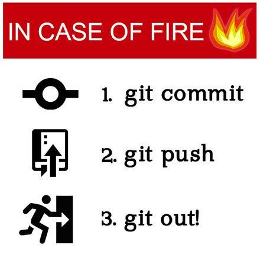
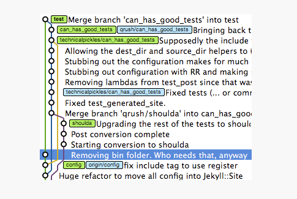
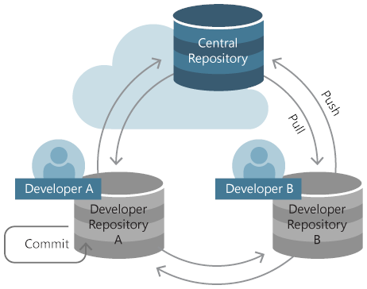
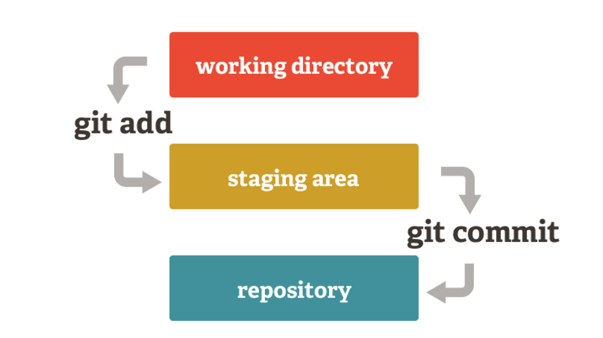
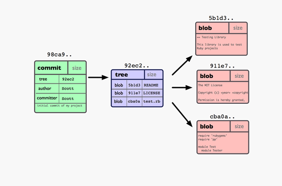

# project_FINAL_FINAL.docx

## {.standout}

\centering { height=90% } 

## What's the problem?

* When working in groups how do you track the complete version of the project?
* How do you sync work between each member?
* How do you make sure what your submitted contains all the code and all the code works together?

## What is version control? 

* Version Control Systems (VCS) are designed to solve this problem 
* Tracks ongoing work by every develop and provide mechanisms to join that work together 
* It also allows you to travel back in time and look at how the project evolved 

::: div

:::

# How Git Works

## {.standout}

\centering { height=80% } 

## What is Git? {.allowframebreaks}

::: columns
:::: column

* Git is the current industry standard VCS 
* Git is distributed - each user syncs their local copies between other users 
* Synchonisation typically happens with a centralised server (like GitHub)
::::
:::: column

::::
:::

\framebreak

::: columns
:::: column 

* A timeline of work history
* Each addition (commit) is a snapshot of how the files in your repository changed 
* The timeline can branch so that new work can be added independently
* You add new work to the HEAD of the timeline

::::
:::: column

{ width=130% }

::::
:::

## Git Data Model 

>>> Git is just a Singly Linked List where Nodes (Commits) are added on Head pointer instead of Tail. Multiple nodes can point to the same node, which creats multiple head pointers (Branches). You can create as many pointers (branches) as you like. You can even have constant pointers (Tags). Each node (commit) contains the SHA of contents of next node (previous commit) therefore if you modify contents of one node, you have to modify all nodes pointing to it.

## Repository 

::: columns
:::: column 

* Your project in git 
* Contains the history of all the work of all the people who contributed 
* Git Providers typically provide lots of additional features to repositories.
* `gh repo create`

::::
:::: column

::::
:::

# How git works 

## Staging 

::: columns
:::: column 

* Prepares files to add to them to the git timeline 
* Choose what files to add or even what lines in the files 
* Allows you to control what to snapshot
* You don't need to save all the work at the same time
* `git add .`

::::
:::: column

::::
:::

## Commits{.allowframebreaks}

* A commit is a snapshot in a point in time
* Each commit contains information about how files have changed in the repository
* Also has a message and information about the contributor
* Each commit forms a timeline representing the changes in the repository
* `git commit -m "message"`

\framebreak 

## Branching

* Each repository has a "trunk" branch (master or main)
* Branching lets you work on different things at the same time 
* Each branch creates a new timeline and lets you work independently
* Branches can be joined back together, joining multiple peoples work together
* Typically you merge your work branch into the trunk
* `git checkout -b my-branch`

## Merging

* One way of joining multiple branches
* Creates a new commit which joins the branches together 
* This new commit represents the sum of all work done in one or more branches
* `git merge another-branch`

## Rebasing 

* Joins branches together by changing the base commit
* Essentially moves a block of commits together to another point in the timeline 
* Typically you rebase the head of trunk onto your work branch
* `git rebase another-branch`

# Grimoire

## The Magic Incantations

* `gh repo clone me/my-repo` - download a repository
* `git pull` - get the latest updates from remote 
* `git checkout -b my-awesome-feature` - create a new branch with a name describing it's purpose
* `git add .` - stages all the files in the current directory 
* `git status` - review the files being added to the commit
* `git commit -m "super helpful message explaining the changes"` - create a new commit with all the new changes
* `git pull --rebase origin main` - Get the latest changes from trunk
* `git push` - update the remote with the new changes 
* `gh pr create` - create a pull request so code can be reviewed and merged in GitHub 

# Octocat and Friends

## What is Github

* World's most popular Git server
* Almost all major OSS is stored here 
* Has free student plans for extra features 
* Provides lots of extra services on top of just Git 

# To Infinity and Beyond 

## What is CI/CD

* In order to ship software succesffuly code needs to be built and tested 
* Building and testing should be done automatically 
* Allows you to make sure incoming changes are correct
* Once code is built, tested, and merged it can be deployed 
* Deployments are updates to the servers hosting your software 
